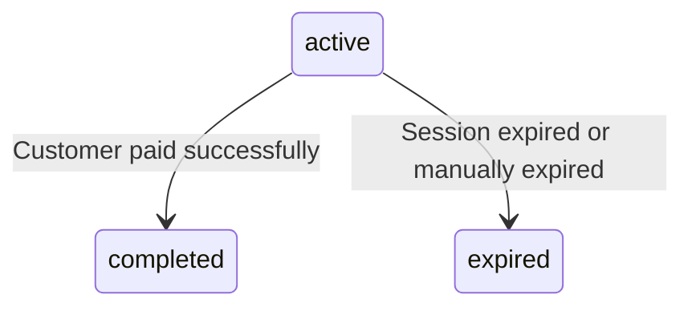

# Checkout Sessions

Checkout sessions provide a PayRex-hosted payment page for your customers. Instead of building your own payment form, redirect customers to a secure, pre-built checkout page.

::: tip When to use Checkout Sessions vs. Elements
Use **Checkout Sessions** when you want PayRex to handle the entire payment UI. Use [Elements](/guide/elements) when you want to embed payment fields directly in your app.
:::

## Create a Checkout Session

::: code-group

```php [Basic]
use LegionHQ\LaravelPayrex\Facades\Payrex;

$session = Payrex::checkoutSessions()->create([ // [!code focus:8]
    'line_items' => [
        ['name' => 'Premium Widget', 'amount' => 10000, 'quantity' => 5],
    ],
    'success_url' => route('checkout.success'),
    'cancel_url' => route('checkout.cancel'),
    'payment_methods' => ['card', 'gcash'],
]);

return redirect()->away($session->url); // [!code focus]
```

```php [With Options]
use LegionHQ\LaravelPayrex\Facades\Payrex;

$session = Payrex::checkoutSessions()->create([
    'line_items' => [
        [
            'name' => 'Premium Widget',
            'amount' => 10000,
            'quantity' => 5,
            'image' => 'https://example.com/images/product.jpg',
        ],
        [
            'name' => 'Basic Widget',
            'amount' => 10000,
            'quantity' => 5,
        ],
    ],
    'success_url' => route('checkout.success'),
    'cancel_url' => route('checkout.cancel'),
    'payment_methods' => ['card', 'gcash'],
    'description' => 'Some description',
    'billing_details_collection' => 'always', // [!code focus:3]
    'submit_type' => 'pay',
    'statement_descriptor' => 'Override statement descriptor',
]);

return redirect()->away($session->url); // [!code focus]
```

```php [With Customer]
use LegionHQ\LaravelPayrex\Facades\Payrex;

$session = Payrex::checkoutSessions()->create([
    'customer_id' => $user->payrexCustomerId(), // [!code focus]
    'line_items' => [
        ['name' => 'Pro Plan', 'amount' => 99900, 'quantity' => 1],
    ],
    'success_url' => route('checkout.success'),
    'cancel_url' => route('checkout.cancel'),
]);

return redirect()->away($session->url);
```

```php [With Metadata]
use LegionHQ\LaravelPayrex\Facades\Payrex;

$session = Payrex::checkoutSessions()->create([
    'line_items' => [
        ['name' => 'Pro Plan', 'amount' => 99900, 'quantity' => 1],
    ],
    'success_url' => route('checkout.success'),
    'cancel_url' => route('checkout.cancel'),
    'metadata' => [ // [!code focus:4]
        'cart_id' => (string) $cart->id,
        'plan' => 'premium',
    ],
]);

return redirect()->away($session->url);
```

:::

**Response:**

```json
{
    "id": "cs_xxxxx",
    "resource": "checkout_session",
    "amount": 589000,
    "customer_id": null,
    "customer": null,
    "customer_reference_id": null,
    "client_secret": "cs_xxxxx_secret_xxxxx",
    "status": "active",
    "currency": "PHP",
    "line_items": [
        {
            "id": "cs_li_xxxxx",
            "resource": "checkout_session_line_item",
            "name": "Wireless Bluetooth Headphones",
            "amount": 250000,
            "quantity": 2,
            "description": null,
            "image": "https://example.com/images/product.jpg"
        },
        {
            "id": "cs_li_yyyyy",
            "resource": "checkout_session_line_item",
            "name": "USB-C Fast Charger",
            "amount": 89000,
            "quantity": 1,
            "description": null,
            "image": null
        }
    ],
    "livemode": false,
    "url": "https://checkout.payrexhq.com/c/cs_xxxxx_secret_xxxxx",
    "payment_intent": {
        "id": "pi_xxxxx",
        "amount": 589000,
        "client_secret": "pi_xxxxx_secret_xxxxx",
        "currency": "PHP",
        "description": null,
        "status": "awaiting_payment_method",
        "payment_methods": ["card", "gcash"],
        "payment_method_options": {
            "card": {
                "capture_type": "automatic"
            }
        },
        "livemode": false,
        "created_at": 1721726975,
        "updated_at": 1721726975
    },
    "metadata": null,
    "success_url": "https://example.com",
    "cancel_url": "https://example.com",
    "payment_methods": ["card", "gcash"],
    "payment_method_options": {
        "card": {
            "capture_type": "automatic"
        }
    },
    "billing_details_collection": "always",
    "description": null,
    "submit_type": "pay",
    "statement_descriptor": "Override statement descriptor",
    "expires_at": 1721813375,
    "created_at": 1721726975,
    "updated_at": 1721726975
}
```

### Parameters

| Parameter | Type | Required | Description |
|---|---|---|---|
| `line_items` | array | Yes | Items to purchase (see below) |
| `success_url` | string | Yes | Redirect URL after successful payment |
| `cancel_url` | string | Yes | Redirect URL when customer cancels |
| `currency` | string | No | Defaults to config `PAYREX_CURRENCY`. Note: the PayRex API requires this field, but the package sends your configured default automatically. |
| `payment_methods` | array | No | Allowed methods: `card`, `gcash`, `maya`, `billease`, `qrph`, `bdo_installment` |
| `customer_id` | string | No | Associated customer ID (`cus_` prefix). The customer is also linked to the underlying payment intent. |
| `customer_reference_id` | string | No | A unique reference for the session aside from its `id` (e.g., order ID, cart ID). Can be used to reconcile the session with your internal system. |
| `description` | string | No | Reference text |
| `expires_at` | integer | No | Expiration Unix timestamp |
| `billing_details_collection` | string | No | `always` or `auto` |
| `submit_type` | string | No | Pay button text |
| `statement_descriptor` | string | No | Bank statement text (max 22 chars) |
| `payment_method_options` | object | No | Payment method configuration (see [Hold then Capture](/guide/hold-then-capture)) |
| `metadata` | object | No | Key-value pairs |

### Line Item Fields

| Field | Type | Required | Description |
|---|---|---|---|
| `name` | string | Yes | Product name |
| `amount` | integer | Yes | Price per unit in cents |
| `quantity` | integer | Yes | Number of units |
| `description` | string | No | Product description |
| `image` | string | No | Product image URL |

## Retrieve a Checkout Session

```php
$session = Payrex::checkoutSessions()->retrieve('cs_xxxxx');

echo $session->status;  // CheckoutSessionStatus::Active
echo $session->url;     // 'https://checkout.payrexhq.com/c/cs_...'
echo $session->amount;  // 100000
echo $session->paymentIntent->id;   // 'pi_xxxxx'
```

### Response Fields

| Field | Type | Description |
|---|---|---|
| `id` | string | Unique identifier (`cs_` prefix) |
| `resource` | string | Always `checkout_session` |
| `amount` | integer | Total amount in cents |
| `client_secret` | string | Session client secret |
| `currency` | string | Three-letter ISO currency code |
| `customer_id` | string\|null | Associated customer ID |
| `customer` | string\|[Customer](/api/customers)\|null | Associated customer (string ID or expanded `Customer` object) |
| `customer_reference_id` | string\|null | Your internal reference ID (e.g., order ID, cart ID) |
| `description` | string\|null | Reference text |
| `status` | string | See [CheckoutSessionStatus](/guide/enums#checkoutsessionstatus) |
| `url` | string | Checkout page URL (redirect customers here) |
| `line_items` | array | Array of line item objects |
| `success_url` | string | Post-payment success redirect |
| `cancel_url` | string | Payment cancellation redirect |
| `payment_intent` | string\|[PaymentIntent](/api/payment-intents)\|null | Associated payment intent (string ID or expanded `PaymentIntent` object) |
| `payment_methods` | array | Allowed payment methods |
| `payment_method_options` | object\|null | Payment method configuration |
| `billing_details_collection` | string\|null | Billing info collection mode |
| `submit_type` | string\|null | Pay button text |
| `statement_descriptor` | string\|null | Bank statement text |
| `expires_at` | integer | Expiration Unix timestamp |
| `metadata` | object\|null | Key-value pairs |
| `livemode` | boolean | Live or test mode |
| `created_at` | integer | Unix timestamp |
| `updated_at` | integer | Unix timestamp |

::: tip Property Access
Response field names above are shown in `snake_case` (matching the raw API response). In PHP, access them as **camelCase** typed properties on the DTO — e.g., `client_secret` becomes `$session->clientSecret`. See [Response Data](/guide/response-data) for details.
:::

### Status Lifecycle



## Expire a Checkout Session

Manually expire an active checkout session to prevent further use:

```php
$session = Payrex::checkoutSessions()->expire('cs_xxxxx');

echo $session->status; // CheckoutSessionStatus::Expired
```

**Response:**

```json
{
    "id": "cs_xxxxx",
    "resource": "checkout_session",
    "amount": 100000,
    "status": "expired",
    "url": "https://checkout.payrexhq.com/c/cs_xxxxx_secret_xxxxx",
    "...": "..."
}
```

::: info Amount Limits
The total checkout amount (sum of `line_items.quantity * line_items.amount`) must be between **₱20.00** (2,000 cents) and **₱59,999,999.99** (5,999,999,999 cents).
:::

::: tip
Checkout sessions expire automatically after **24 hours** by default. You can override this by setting the `expires_at` parameter when creating a session.
:::

## Further Reading

- [Checkout Sessions Guide](/guide/checkout-sessions-guide) — Step-by-step hosted checkout guide
- [Choosing an Integration](/guide/choosing-an-integration) — Compare Checkout Sessions vs. Elements
- [Payment Methods](/guide/payment-methods) — Available payment methods
- [Webhook Handling](/guide/webhooks) — Handle `payment_intent.succeeded` events
