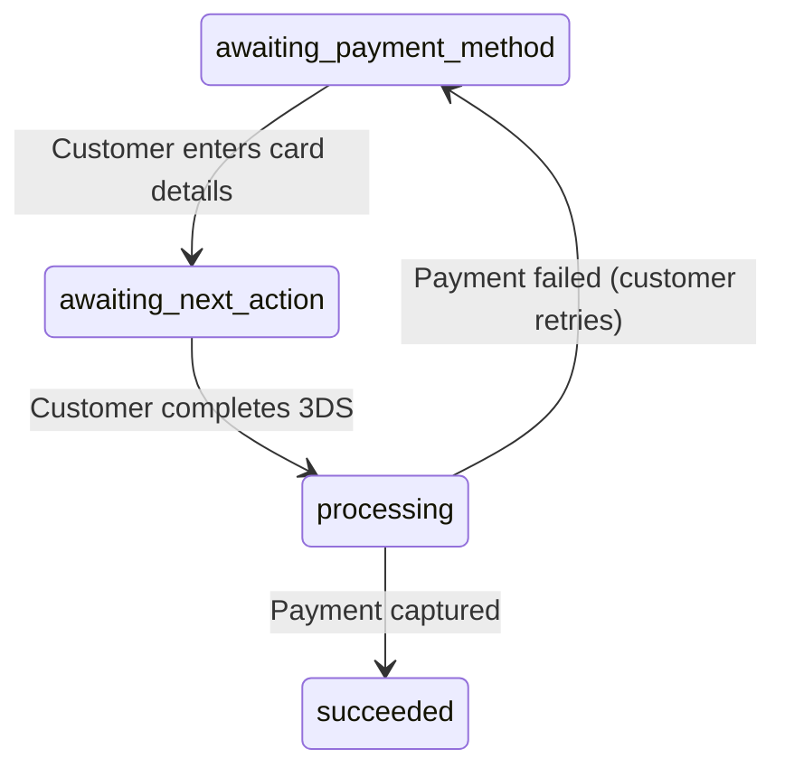

# Accept a Payment

Learn how to accept a payment from your customer. This guide covers the standard flow where the customer is charged immediately when they complete payment.

::: tip Looking for delayed capture?
If you need to authorize (hold) funds first and charge later — for example, after confirming inventory or shipping — see [Hold then Capture](/guide/hold-then-capture) instead.
:::

## How It Works

```
1. You create a Payment Intent (or Checkout Session) with 'card' in payment_methods
2. Customer enters their card details and completes authentication (e.g. 3D Secure)
3. Payment is captured automatically
4. PayRex sends a payment_intent.succeeded webhook to your server
5. You fulfill the order
```

::: info 3D Secure
Card payments may require 3D Secure (3DS) authentication depending on the card network, issuing bank, and region. This is handled automatically by PayRex — your integration code is the same whether or not 3DS is triggered.
:::

## Step 1: Create the Payment

Choose your integration — [Checkout Session](/guide/checkout-sessions-guide) for a PayRex-hosted page, or [Payment Intent + Elements](/guide/elements) for a custom payment form in your app. See [Choosing an Integration](/guide/choosing-an-integration) if you're unsure.

::: code-group

```php [Checkout Session]
use LegionHQ\LaravelPayrex\Facades\Payrex;

$session = Payrex::checkoutSessions()->create([ // [!code focus:8]
    'line_items' => [
        ['name' => 'Wireless Bluetooth Headphones', 'amount' => 250000, 'quantity' => 1],
    ],
    'payment_methods' => ['card'],
    'success_url' => route('checkout.success'),
    'cancel_url' => route('checkout.cancel'),
]);

return redirect()->away($session->url); // [!code focus]
```

```php [Payment Intent + Elements]
use LegionHQ\LaravelPayrex\Facades\Payrex;

$paymentIntent = Payrex::paymentIntents()->create([ // [!code focus:5]
    'amount' => 10000, // ₱100.00
    'payment_methods' => ['card'],
    'description' => 'ORD-2026-0042',
]);

// Pass the clientSecret to your frontend for PayRex Elements
return response()->json([
    'client_secret' => $paymentIntent->clientSecret,
]);
```

:::

::: tip Multiple Payment Methods
You can accept more than just cards. Add other methods to the `payment_methods` array and PayRex will display all available options to the customer:
```php
'payment_methods' => ['card', 'gcash', 'maya', 'qrph'],
```
:::

## Step 2: Customer Completes Payment

For **Checkout Session**, the customer is redirected to a PayRex-hosted page where they enter their card details and complete payment. No frontend code is needed.

For **Payment Intent + Elements**, you mount the payment form on your page using the PayRex JS SDK. The customer enters their card details, completes 3D Secure if required, and PayRex captures the payment automatically. See the [Elements](/guide/elements) guide for complete Vanilla JS, Vue, and React examples.

In both cases, PayRex handles card validation, 3D Secure authentication, and payment capture — your backend doesn't need to do anything until the webhook arrives.

## Step 3: Confirm Payment Succeeded

Once the customer completes payment, PayRex sends a `payment_intent.succeeded` webhook to your server. Listen for this event to fulfill the order.

First, make sure webhooks are enabled in your `.env`:

```ini
PAYREX_WEBHOOK_ENABLED=true
PAYREX_WEBHOOK_SECRET=your_webhook_secret
```

Then add a listener in your `AppServiceProvider::boot()`:

```php
use Illuminate\Support\Facades\Event;
use LegionHQ\LaravelPayrex\Events\PaymentIntentSucceeded;

Event::listen(PaymentIntentSucceeded::class, function (PaymentIntentSucceeded $event) { // [!code focus:8]
    $paymentIntent = $event->data();

    // Fulfill the order — update status, send confirmation email, etc.
    Order::query()
        ->where('payment_intent_id', $paymentIntent->id)
        ->update(['status' => 'paid']);
});
```

See [Webhook Handling](/guide/webhooks) for the full guide on signature verification, event classes, queued listeners, and `constructEvent()`.

::: warning Don't rely on the return URL for fulfillment
The return URL (for Elements) or success URL (for Checkout Sessions) is a **UX mechanism** — it brings the customer back to your site so you can show a success message. The customer might close their browser before the redirect happens. Always use webhooks for order fulfillment.
:::

## Status Lifecycle



| Status | Description |
|---|---|
| `awaiting_payment_method` | Payment intent created, waiting for customer |
| `awaiting_next_action` | Customer selected a payment method, authentication in progress |
| `processing` | Authentication completed, payment is being processed |
| `succeeded` | Payment captured successfully |

## Further Reading

- [Checkout Sessions](/guide/checkout-sessions-guide) — Use a PayRex-hosted payment page
- [Elements](/guide/elements) — Build a custom payment form with the PayRex JS SDK
- [Hold then Capture](/guide/hold-then-capture) — Authorize first, charge later
- [Webhook Handling](/guide/webhooks) — Set up event listeners for payment notifications
- [Test Cards](/guide/test-cards) — Card numbers for testing in test mode
