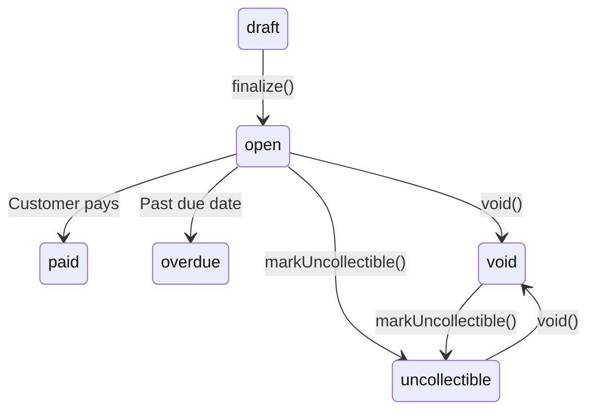

# Billing Statements

Billing statements (invoices) let you bill customers with a payment link they can use to pay on their own time. Create a statement with line items, finalize it to generate a payment URL, and send it to the customer.

::: tip When to use Billing Statements
Use billing statements when you need to invoice customers for goods or services — especially when payment isn't immediate (e.g., net-30 terms). For real-time payments, use [Payment Intents](/api/payment-intents) or [Checkout Sessions](/guide/checkout-sessions-guide) instead.
:::

## How It Works

```
1. Create a billing statement in draft status
2. Complete required details (due date, line items)
3. Finalize it → status becomes open, payment URL is generated
4. Send the billing statement to the customer via email
5. Customer pays via the payment link
6. PayRex sends a billing_statement.paid webhook to your server
```

## Step 1: Create a Billing Statement

Billing statements require a customer. If you're using the [Billable Customer](/guide/billable-customer) trait, use `$user->payrexCustomerId()`. Otherwise, pass a customer ID directly.

```php
use LegionHQ\LaravelPayrex\Facades\Payrex;

$statement = Payrex::billingStatements()->create([ // [!code focus:6]
    'customer_id' => $user->payrexCustomerId(),
    'payment_settings' => [
        'payment_methods' => ['card', 'gcash', 'maya'],
    ],
]);
```

The statement starts in `draft` status. While in draft, you can update details, set a due date, and add line items.

### Complete the Required Details

Update the billing statement with a due date and any other details before finalizing:

```php
$statement = Payrex::billingStatements()->update($statement->id, [
    'due_at' => now()->addDays(30)->timestamp,
]);
```

### Adding Line Items

Add line items to the billing statement via the `billingStatementLineItems()` resource:

```php
Payrex::billingStatementLineItems()->create([ // [!code focus:6]
    'billing_statement_id' => $statement->id,
    'description' => 'Consulting — February 2026',
    'unit_price' => 500000,
    'quantity' => 2,
]);

Payrex::billingStatementLineItems()->create([ // [!code focus:6]
    'billing_statement_id' => $statement->id,
    'description' => 'Hosting — February 2026',
    'unit_price' => 99900,
    'quantity' => 1,
]);
```

See [Billing Statement Line Items API](/api/billing-statement-line-items) for update and delete operations.

## Step 2: Finalize

Finalizing transitions the statement from `draft` to `open`, generates a payment URL, and creates the associated payment intent:

```php
$statement = Payrex::billingStatements()->finalize($statement->id); // [!code focus]

echo $statement->status; // BillingStatementStatus::Open
echo $statement->billingStatementUrl;    // 'https://bill.payrexhq.com/b/...'
```

::: warning
Once finalized, line items are locked and cannot be modified. Make sure all items are correct before finalizing.
:::

## Step 3: Send to the Customer

Send the billing statement to the customer's email address:

```php
Payrex::billingStatements()->send($statement->id); // [!code focus]
```

The customer receives an email with a link to the payment page.

## Step 4: Confirm Payment via Webhook

Listen for the `billing_statement.paid` webhook event to confirm payment:

```php
use Illuminate\Support\Facades\Event;
use LegionHQ\LaravelPayrex\Events\BillingStatementPaid;

Event::listen(BillingStatementPaid::class, function (BillingStatementPaid $event) { // [!code focus:8]
    $statement = $event->data();

    // Mark the invoice as paid in your system
    Invoice::query()
        ->where('billing_statement_id', $statement->id)
        ->update(['status' => 'paid']);
});
```

### Other Useful Events

| Event | When |
|---|---|
| `BillingStatementWillBeDue` | **5 days** before the due date — useful for sending reminders |
| `BillingStatementOverdue` | **5 days** after the due date — useful for follow-up actions |
| `BillingStatementPaid` | Customer has paid the billing statement |

See [Webhook Handling](/guide/webhooks) for the full list of billing statement events.

## Lifecycle



### Voiding a Statement

Void a billing statement that was issued in error:

```php
$statement = Payrex::billingStatements()->void($statement->id);
```

### Marking as Uncollectible

Mark a billing statement as uncollectible when payment is unlikely to be received:

```php
$statement = Payrex::billingStatements()->markUncollectible($statement->id);
```

## Further Reading

- [Billing Statements API](/api/billing-statements) — Full parameter and response reference
- [Billable Customer](/guide/billable-customer) — Link your User model to PayRex customers
- [Webhook Handling](/guide/webhooks) — Set up event listeners for billing statement notifications
- [Customers API](/api/customers) — Manage customer records
