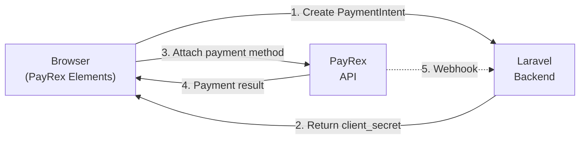

# Elements

PayRex provides a JavaScript SDK (PayRex Elements) for building custom payment forms on the client side. This guide covers how to use your `PAYREX_PUBLIC_KEY` with the PayRex JS SDK in a Laravel application.

::: tip When to use Elements vs. Checkout Sessions
- **Checkout Sessions** — Redirect customers to a PayRex-hosted payment page. No frontend code needed. Best for simple integrations. See [Checkout Sessions](/guide/checkout-sessions-guide).
- **PayRex Elements** — Embed payment fields directly in your app's UI. Full control over the payment experience. Best when you want a custom checkout flow.
:::

## Overview

The PayRex Elements flow works in two steps:

1. **Backend:** Create a Payment Intent and pass its `client_secret` to the frontend.
2. **Frontend:** Use the PayRex JS SDK to mount a payment element and attach the payment method.



## Exposing the Public Key

The `PAYREX_PUBLIC_KEY` is safe to expose in frontend code. Pass it to your views or JavaScript:

### Via Blade

```php
// In your controller or a view composer
return view('checkout', [
    'payrexPublicKey' => config('payrex.public_key'), // [!code highlight]
]);
```

### Via Inertia

```php
// In HandleInertiaRequests middleware
public function share(Request $request): array
{
    return [
        ...parent::share($request),
        'payrex' => [ // [!code highlight:3]
            'publicKey' => config('payrex.public_key'),
        ],
    ];
}
```

### Via API Endpoint

```php
// routes/api.php
Route::get('/config/payrex', function () {
    return response()->json([
        'public_key' => config('payrex.public_key'),
    ]);
});
```

## Step 1: Create a Payment Intent (Backend)

Create a controller that generates a Payment Intent and returns the `client_secret` and a `return_url` for post-payment redirect:

```php
use Illuminate\Http\JsonResponse;
use LegionHQ\LaravelPayrex\Facades\Payrex;

class PaymentController extends Controller
{
    public function createIntent(): JsonResponse
    {
        $paymentIntent = Payrex::paymentIntents()->create([ // [!code highlight:5]
            'amount' => 10000, // ₱100.00
            'payment_methods' => ['card', 'gcash', 'maya', 'qrph'],
            'description' => 'Payment from checkout',
        ]);

        return response()->json([ // [!code highlight:4]
            'client_secret' => $paymentIntent->clientSecret,
            'return_url' => route('payment.success'),
        ]);
    }
}
```

::: info Amount is in Cents
The `amount` value is in **cents** (the smallest currency unit). For example, `10000` equals ₱100.00. The `currency` defaults to your configured `PAYREX_CURRENCY` — see [Configuration](/guide/configuration#default-currency).
:::

### Options

You can customize the payment intent with additional parameters:

```php
$paymentIntent = Payrex::paymentIntents()->create([
    'amount' => 10000, // ₱100.00
    'payment_methods' => ['card', 'gcash', 'maya', 'qrph'],
    'description' => 'ORD-2026-0042',
    'statement_descriptor' => 'MYSTORE',             // Bank statement text // [!code highlight]
    'metadata' => [                                   // [!code highlight:3]
        'order_id' => (string) $order->id,
    ],
]);
```

See [Payment Intents API](/api/payment-intents) for all available parameters.

**Response:**

```json
{
    "client_secret": "pi_xxxxx_secret_xxxxx"
}
```

::: warning
Never expose your `PAYREX_SECRET_KEY` to the frontend. The Payment Intent must be created on the server side. Only the `client_secret` and `public_key` should be passed to the browser.
:::

## Step 2: Collect Payment (Frontend)

### Include the PayRex JS SDK

Add the PayRex JS SDK to your page. You must always load it from `js.payrexhq.com`:

```html
<script src="https://js.payrexhq.com"></script>
```

::: danger Do not self-host Payrex.js
Always load the script from `https://js.payrexhq.com`. Do not download or bundle a copy — loading from the official domain is required for PCI-DSS compliance.
:::

::: tip CommonJS / ES6 Modules
If you prefer `import` syntax instead of a `<script>` tag, use the [`payrex-js`](https://github.com/payrexhq/payrex-js) npm package:
```bash
npm install payrex-js
```
```js
import { loadPayrex } from 'payrex-js';

const payrex = await loadPayrex('pk_test_...');
```
This returns a Promise that resolves with a `Payrex` instance once the script has loaded. Must be called from the client side.
:::

### Vanilla JavaScript Example

```html
<form id="payment-form">
    <div id="payment-element"></div>
    <button type="submit" id="pay-button">Pay</button>
    <div id="error-message"></div>
</form>

<script src="https://js.payrexhq.com"></script>
<script>
    // Initialize Payrex.js with your public key
    const payrex = Payrex('{{ config("payrex.public_key") }}');

    async function initialize() {
        const button = document.getElementById('pay-button');
        const errorMessage = document.getElementById('error-message');

        try {
            // Create the Payment Intent on your backend
            const response = await fetch('/payment/create-intent', {
                method: 'POST',
                headers: {
                    'Content-Type': 'application/json',
                    'X-CSRF-TOKEN': document.querySelector('meta[name="csrf-token"]').content,
                },
                body: JSON.stringify({ amount: 10000 }),
            });

            if (!response.ok) {
                throw new Error('Failed to create payment intent.');
            }

            const { client_secret, return_url } = await response.json();

            // Create an Elements instance with the client secret
            const elements = payrex.elements({ clientSecret: client_secret }); // [!code highlight]

            // Create and mount the payment element
            const paymentElement = elements.create('payment', { // [!code highlight:3]
                layout: 'accordion',
            });
            paymentElement.mount('#payment-element'); // [!code highlight]

            // Handle form submission
            const form = document.getElementById('payment-form');
            form.addEventListener('submit', async (event) => {
                event.preventDefault();

                button.disabled = true;
                button.textContent = 'Processing...';
                errorMessage.textContent = '';

                try {
                    // Attach the payment method and confirm
                    const { error } = await payrex.attachPaymentMethod({ // [!code highlight:6]
                        elements,
                        options: {
                            return_url,
                        },
                    });

                    if (error) {
                        errorMessage.textContent = error.message;
                        button.disabled = false;
                        button.textContent = 'Pay';
                    }
                    // If successful, the customer is redirected to return_url
                } catch (err) {
                    errorMessage.textContent = err.message;
                    button.disabled = false;
                    button.textContent = 'Pay';
                }
            });
        } catch (err) {
            errorMessage.textContent = err.message;
        }
    }

    initialize();
</script>
```

### Inertia + Vue.js Example

Pass the `publicKey` as a prop from your controller:

```php
return Inertia::render('Checkout', [
    'publicKey' => config('payrex.public_key'),
]);
```

```vue
<script setup>
import { ref } from 'vue';
import axios from 'axios';

const props = defineProps({
    publicKey: { type: String, required: true },
});

const paymentContainer = ref(null);
const processing = ref(false);
const error = ref(null);
const returnUrl = ref(null);

let payrexInstance = null;
let elementsInstance = null;

async function initialize() {
    try {
        // Create Payment Intent on your backend
        const { data } = await axios.post('/payment/create-intent', {
            amount: 1000.00,
        });

        returnUrl.value = data.return_url;

        // Initialize PayRex Elements with branding
        payrexInstance = window.Payrex(props.publicKey); // [!code highlight]
        elementsInstance = payrexInstance.elements({ // [!code highlight:8]
            clientSecret: data.client_secret,
            style: {
                variables: {
                    primaryColor: '#6A63EF',
                },
            },
        });

        // Create and mount the payment element
        const paymentElement = elementsInstance.create('payment', { // [!code highlight:3]
            layout: 'accordion',
        });
        paymentElement.mount(paymentContainer.value); // [!code highlight]
    } catch (err) {
        error.value = err.response?.data?.message ?? err.message;
    }
}

async function handleSubmit() {
    processing.value = true;
    error.value = null;

    try {
        const { error: paymentError } = await payrexInstance.attachPaymentMethod({ // [!code highlight:6]
            elements: elementsInstance,
            options: {
                return_url: returnUrl.value,
            },
        });

        if (paymentError) {
            error.value = paymentError.message;
            processing.value = false;
        }
        // If successful, the customer is redirected to return_url
    } catch (err) {
        error.value = err.response?.data?.message ?? err.message;
        processing.value = false;
    }
}

initialize();
</script>

<template>
    <form @submit.prevent="handleSubmit">
        <div ref="paymentContainer" />
        <p v-if="error" class="text-red-500 text-sm">{{ error }}</p>
        <button type="submit" :disabled="processing">
            {{ processing ? 'Processing...' : 'Pay' }}
        </button>
    </form>
</template>
```

### Inertia + React Example

```jsx
import { useEffect, useRef, useState } from 'react';
import axios from 'axios';

export default function CheckoutForm({ publicKey }) {
    const paymentRef = useRef(null);
    const payrexRef = useRef(null);
    const elementsRef = useRef(null);
    const returnUrlRef = useRef(null);
    const [processing, setProcessing] = useState(false);
    const [error, setError] = useState(null);

    useEffect(() => {
        let paymentElement = null;

        async function initialize() {
            try {
                const { data } = await axios.post('/payment/create-intent', {
                    amount: 1000.00,
                });

                const { client_secret, return_url } = data;
                returnUrlRef.current = return_url;

                payrexRef.current = window.Payrex(publicKey); // [!code highlight]
                elementsRef.current = payrexRef.current.elements({ // [!code highlight:8]
                    clientSecret: client_secret,
                    style: {
                        variables: {
                            primaryColor: '#6A63EF',
                        },
                    },
                });

                paymentElement = elementsRef.current.create('payment', { // [!code highlight:3]
                    layout: 'accordion',
                });
                paymentElement.mount(paymentRef.current); // [!code highlight]
            } catch (err) {
                setError(err.response?.data?.message ?? err.message);
            }
        }

        initialize();
        return () => paymentElement?.unmount();
    }, [publicKey]);

    const handleSubmit = async (e) => {
        e.preventDefault();
        setProcessing(true);
        setError(null);

        try {
            const { error: paymentError } = await payrexRef.current.attachPaymentMethod({ // [!code highlight:6]
                elements: elementsRef.current,
                options: {
                    return_url: returnUrlRef.current,
                },
            });

            if (paymentError) {
                setError(paymentError.message);
                setProcessing(false);
            }
        } catch (err) {
            setError(err.message);
            setProcessing(false);
        }
    };

    return (
        <form onSubmit={handleSubmit}>
            <div ref={paymentRef} />
            {error && <p className="text-red-500 text-sm">{error}</p>}
            <button type="submit" disabled={processing}>
                {processing ? 'Processing...' : 'Pay'}
            </button>
        </form>
    );
}
```

::: info Why axios?
Laravel sets an `XSRF-TOKEN` cookie on every response, and axios automatically reads this cookie and sends it as the `X-XSRF-TOKEN` header on every request. This means CSRF protection works out of the box — no need to manually extract the token from a meta tag.
:::

## Customizing the Payment Element

The PayRex JS SDK supports several customization options for the payment element.

### Layout

Use `"accordion"` to display payment methods in a collapsible accordion:

```js
const paymentElement = elements.create('payment', {
    layout: 'accordion',
});
```

### Branding

Customize the primary color of the payment element to match your brand. Pass a `style` object when creating the Elements instance:

```js
const elements = payrex.elements({
    clientSecret: client_secret,
    style: {
        variables: {
            primaryColor: '#F63711',
        },
    },
});
```

### Pre-filling Billing Details

Provide default values for billing fields to reduce friction for returning customers:

```js
const paymentElement = elements.create('payment', {
    layout: 'accordion',
    defaultValues: {
        billingDetails: {
            name: 'Juan Dela Cruz',
            phone: '+639170000000',
            email: 'juan@example.com',
            address: {
                line1: 'Address Line 1',
                line2: 'Address Line 2',
                country: 'PH',
                city: 'Manila',
                state: 'Metro Manila',
                postalCode: '1000',
            },
        },
    },
});
```

### Controlling Billing Field Visibility

Control which billing information fields are displayed. Each field accepts `"auto"` (PayRex decides based on the payment method) or `"always"` (always shown):

```js
const paymentElement = elements.create('payment', {
    layout: 'accordion',
    fields: {
        billingDetails: {
            email: 'auto',
            name: 'auto',
            phone: 'auto',
            address: {
                line1: 'auto',
                line2: 'auto',
                city: 'auto',
                postalCode: 'auto',
                state: 'auto',
                country: 'auto',
            },
        },
    },
});
```

::: info
PayRex's Fraud & Risk team may require all billing fields if your account's chargeback rate increases, regardless of your `fields` configuration. See the [PayRex Elements documentation](https://docs.payrex.com/docs/guide/developer_handbook/payments/integrations/elements) for the latest details.
:::

## Handling the Return URL

The return URL is a **UX mechanism** — it brings the customer back to your site after payment so you can show them a success or failure message. It is not the place to trigger order fulfillment or business logic. The customer might close their browser before the redirect happens, so use [webhook events](/guide/webhooks) (`payment_intent.succeeded`) for reliable fulfillment instead.

After the customer completes (or fails) payment, they are redirected to your `return_url` with a `payment_intent_client_secret` query parameter appended. You can check the payment status to display the appropriate message:

### Server-Side Verification (Recommended)

After payment, PayRex redirects the customer to your `return_url` with a `payment_intent_client_secret` query parameter appended. Extract the payment intent ID from it using `Str::before()`:

```php
use Illuminate\Support\Str;
use LegionHQ\LaravelPayrex\Enums\PaymentIntentStatus;
use LegionHQ\LaravelPayrex\Facades\Payrex;

Route::get('/payment/success', function (Request $request) {
    $clientSecret = $request->query('payment_intent_client_secret', '');
    $paymentIntentId = Str::before($clientSecret, '_secret_') ?: null; // [!code highlight]

    if (! $paymentIntentId) {
        return redirect()->route('checkout')->with('error', 'Invalid payment session.');
    }

    $paymentIntent = Payrex::paymentIntents()->retrieve($paymentIntentId); // [!code highlight]

    if ($paymentIntent->status === PaymentIntentStatus::Succeeded) { // [!code highlight:5]
        return view('payment.success', [
            'amount' => $paymentIntent->amount,
        ]);
    }

    return redirect()->route('checkout')->with('error', 'Payment was not completed.');
})->middleware('auth')->name('payment.success');
```

### Client-Side Verification

You can also use the PayRex JS SDK to check the payment status directly from the browser using the `payment_intent_client_secret` query parameter:

```js
const payrex = Payrex('your_public_key');
const clientSecret = new URLSearchParams(window.location.search).get('payment_intent_client_secret');

const paymentIntent = await payrex.getPaymentIntent(clientSecret); // [!code highlight]

switch (paymentIntent.status) { // [!code highlight:11]
    case 'succeeded':
        // Payment completed — show success message
        break;
    case 'processing':
        // Payment is still processing — show pending message
        break;
    case 'awaiting_payment_method':
        // Payment failed — allow customer to retry
        break;
}
```

::: warning
Do not place order fulfillment logic (e.g., sending receipts, updating inventory) in the return URL handler. Use [webhook events](/guide/webhooks) for that — the return URL is only for displaying feedback to the customer.
:::

## Hold then Capture

Elements works with hold-then-capture payment intents. The frontend experience is identical — the only difference is on the backend when creating the payment intent. See the [Hold then Capture](/guide/hold-then-capture) guide for the full flow.

## Security Best Practices

1. **Never expose `PAYREX_SECRET_KEY`** — Only `PAYREX_PUBLIC_KEY` and `client_secret` should reach the browser.
2. **Validate amounts server-side** — Don't trust amounts sent from the client. Calculate the correct amount on your server.
3. **Use webhooks for fulfillment** — Don't rely solely on the return URL. Use [webhook events](/guide/webhooks) (`payment_intent.succeeded`) to fulfill orders, as the customer might close the browser before being redirected.
4. **Verify payment status** — Always retrieve the Payment Intent server-side after return to confirm the actual status.

---

**Next up:** [Webhook Handling](/guide/webhooks) — set up event listeners so your app knows when payments succeed, fail, or change state.

## Further Reading

- [PayRex Elements Documentation](https://docs.payrex.com/docs/guide/developer_handbook/payments/integrations/elements) — Full PayRex JS SDK reference, element types, styling options, and more.
- [Payment Intents API](/api/payment-intents) — Create, retrieve, cancel, and capture payment intents.
- [Webhook Handling](/guide/webhooks) — Handle `payment_intent.succeeded` events for reliable fulfillment.
