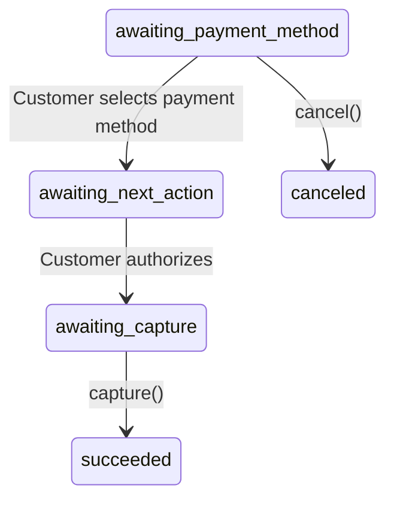

# Hold then Capture

By default, card payments are captured automatically when the customer completes payment. With **hold then capture**, the customer's card is authorized (funds are held) but not charged immediately. You then capture the held amount later when you're ready.

::: info Card-Only
Hold then capture only applies to card payments. If you include other payment methods alongside card (e.g. `['card', 'gcash']`), the card payment will use hold-then-capture while the other methods will process as normal automatic capture.
:::

## When to Use It

- **E-commerce** — Authorize at checkout, capture after confirming inventory or preparing the order for shipment
- **Hotels & rentals** — Hold the estimated amount at booking, capture the final amount after the stay
- **Marketplaces** — Authorize the buyer's card, capture once the seller confirms the order
- **Pre-orders** — Hold funds when the customer places a pre-order, capture when the item ships

If you don't need to delay charging, use the default automatic capture — it's simpler and requires no extra code.

## How It Works

```
1. Create a Payment Intent with capture_type: 'manual'
2. Customer authorizes the payment (card is held, not charged)
3. Payment Intent status → 'awaiting_capture'
4. You call capture() when ready to charge
5. Payment Intent status → 'succeeded'
```

::: warning Capture Deadline
Authorizations expire in **7 days**. You must capture the authorized amount before `capture_before_at` (returned in the Payment Intent response). If the deadline passes, the authorization expires — the payment intent is canceled and the held funds are released back to the customer.
:::

## Step 1: Create with Hold then Capture

Set `capture_type` to `'manual'` in the payment method options. The setup differs depending on your integration:

::: code-group

```php [Payment Intent + Elements]
use LegionHQ\LaravelPayrex\Facades\Payrex;

$paymentIntent = Payrex::paymentIntents()->create([ // [!code focus:7]
    'amount' => 10000, // ₱100.00
    'payment_methods' => ['card'],
    'payment_method_options' => [
        'card' => ['capture_type' => 'manual'],
    ],
]);

// Pass the clientSecret to your frontend for PayRex Elements
return response()->json([
    'client_secret' => $paymentIntent->clientSecret,
]);
```

```php [Checkout Session]
use LegionHQ\LaravelPayrex\Facades\Payrex;

$session = Payrex::checkoutSessions()->create([
    'line_items' => [
        ['name' => 'Premium Widget', 'amount' => 10000, 'quantity' => 1],
    ],
    'payment_methods' => ['card'],
    'payment_method_options' => [ // [!code focus:3]
        'card' => ['capture_type' => 'manual'],
    ],
    'success_url' => route('checkout.success'),
    'cancel_url' => route('checkout.cancel'),
]);

return redirect()->away($session->url); // [!code focus]
```

:::

The customer experience is the same as a regular payment — the hold happens behind the scenes during authorization. Steps 2 and 3 below are identical regardless of which integration you use.

## Step 2: Know When to Capture

After you create the payment intent, the customer completes authorization on the frontend (e.g. 3D Secure). This happens asynchronously — your backend doesn't know about it until PayRex notifies you.

When the customer authorizes, two things change on the payment intent:
- **`status`** becomes `awaiting_capture`
- **`amountCapturable`** is populated with the authorized amount (e.g. `10000`)

There are two ways to know when this happens:

### Option A: Webhook Event (Recommended)

Listen for the `PaymentIntentAmountCapturable` event. The event payload contains the updated payment intent with `amountCapturable` already populated:

```php
use Illuminate\Support\Facades\Event;
use LegionHQ\LaravelPayrex\Events\PaymentIntentAmountCapturable;
use LegionHQ\LaravelPayrex\Facades\Payrex;

Event::listen(PaymentIntentAmountCapturable::class, function (PaymentIntentAmountCapturable $event) { // [!code focus:12]
    $paymentIntent = $event->data();

    $paymentIntent->status;           // PaymentIntentStatus::AwaitingCapture
    $paymentIntent->amountCapturable; // 10000 — the authorized amount

    // Verify inventory, check fraud rules, etc.
    // Then capture when ready:
    Payrex::paymentIntents()->capture($paymentIntent->id, [
        'amount' => $paymentIntent->amountCapturable,
    ]);
});
```

::: tip
For most use cases, you'll want to capture from a job, admin action, or scheduled task — not directly in the webhook listener. The listener is a good place to queue the work or flag the order as "ready to capture."
:::

### Option B: Retrieve the Payment Intent

If you're capturing from an admin panel, background job, or scheduled task, retrieve the payment intent first to get the current `amountCapturable`:

```php
use LegionHQ\LaravelPayrex\Facades\Payrex;

$paymentIntent = Payrex::paymentIntents()->retrieve('pi_xxxxx');

if ($paymentIntent->status === PaymentIntentStatus::AwaitingCapture) { // [!code focus:5]
    Payrex::paymentIntents()->capture($paymentIntent->id, [
        'amount' => $paymentIntent->amountCapturable,
    ]);
}
```

## Step 3: Capture the Payment

The `capture()` call charges the customer's card. The `amount` you pass must be less than or equal to `amountCapturable`.

::: code-group

```php [Full Capture]
use LegionHQ\LaravelPayrex\Facades\Payrex;

$paymentIntent = Payrex::paymentIntents()->capture('pi_xxxxx', [ // [!code focus:3]
    'amount' => 10000, // Must be ≤ amountCapturable
]);
```

```php [Partial Capture]
use LegionHQ\LaravelPayrex\Facades\Payrex;

// Capture less than the authorized amount
// The remaining held funds are released back to the customer
$paymentIntent = Payrex::paymentIntents()->capture('pi_xxxxx', [ // [!code focus:3]
    'amount' => 5000, // Capture ₱50.00 of the authorized ₱100.00
]);
```

:::

After a successful capture:
- `status` becomes `succeeded`
- `amountReceived` reflects the captured amount
- `amountCapturable` drops to `0`

::: warning One-Time Capture
You can only capture a payment intent **once** — either for the full or a partial amount. Once captured, you cannot capture further amounts. If you capture a partial amount, the remaining held funds are released back to the customer.
:::

## Status Lifecycle



| Status | Description |
|---|---|
| `awaiting_payment_method` | Payment intent created, waiting for customer |
| `awaiting_next_action` | Customer selected a payment method, authentication in progress |
| `awaiting_capture` | Customer authorized, funds are held — ready to capture. Authorizations expire in 7 days — if not captured before `capture_before_at`, the held funds are released back to the customer. |
| `succeeded` | Payment captured successfully |
| `canceled` | Payment intent was canceled via `cancel()` |

## Further Reading

- [Payment Intents API](/api/payment-intents) — Full parameter and response reference
- [Checkout Sessions](/guide/checkout-sessions-guide) — Checkout Sessions also support hold-then-capture
- [Accept a Payment](/guide/accept-a-payment) — Standard automatic capture flow
- [Webhook Handling](/guide/webhooks) — Listen for `PaymentIntentAmountCapturable` events
- [Test Cards](/guide/test-cards) — Card numbers for testing in test mode
